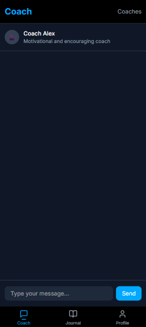
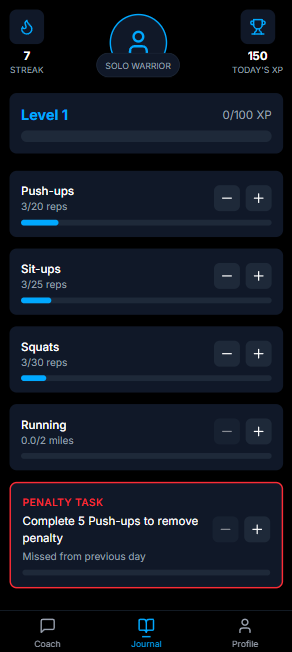
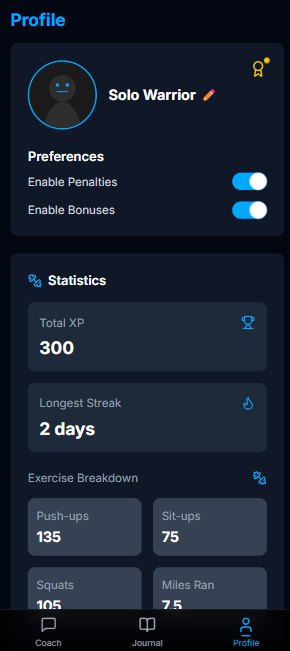

# SoloFitness

<div align="center">
  <p><i>Level up your fitness journey with the power of a hunter.</i></p>
</div>

## 📖 Overview

SoloFitness is a modern fitness application inspired by the aesthetic and theme of the popular manhwa "Solo Leveling." This app helps users track their fitness progress through an engaging, gamified experience. The application focuses on a clean, minimalist design with the signature Solo Leveling blue accent (#00A8FF), creating an immersive fitness journey where users can level up their physical abilities.

## ✨ Features

- **🤖 AI Coach**: Get motivational messages, quick tips, and personalized guidance
- **📓 Fitness Journal**: Track daily goals, exercises, and progress
- **📊 XP System**: Earn experience points for completed workouts and level up
- **🏆 Achievements**: Unlock achievements as you progress in your fitness journey
- **📱 Modern UI**: Clean, responsive design with smooth animations and transitions
- **🔐 User Authentication**: Secure login and registration system
- **📈 Progress Tracking**: Detailed workout and exercise history
- **🎯 Streak System**: Maintain your workout streak for bonus rewards

## 🖼️ Screenshots

<div align="center">
  <table>
    <tr>
      <td align="center"><b>Coach Page</b></td>
      <td align="center"><b>Journal Page</b></td>
      <td align="center"><b>Profile Page</b></td>
    </tr>
    <tr>
      <td></td>
      <td></td>
      <td></td>
    </tr>
  </table>
</div>

## 🛠️ Tech Stack

- **Frontend**:
  - [Next.js 15.3.0](https://nextjs.org/) - React framework
  - [React 19](https://react.dev/) - UI library
  - [TypeScript](https://www.typescriptlang.org/) - Type safety
  - [Tailwind CSS 4](https://tailwindcss.com/) - Styling
  - [Framer Motion](https://www.framer.com/motion/) - Animations

- **Backend**:
  - [Next.js API Routes](https://nextjs.org/docs/api-routes/introduction) - Backend API
  - [Prisma 6.6.0](https://www.prisma.io/) - Database ORM
  - [MongoDB](https://www.mongodb.com/) - Database
  - [JWT](https://jwt.io/) - Authentication
  - [bcrypt](https://www.npmjs.com/package/bcryptjs) - Password hashing

- **UI Components**:
  - [Radix UI](https://www.radix-ui.com/) - Accessible components
  - [Lucide React](https://lucide.dev/) - Icon library
  - [Class Variance Authority](https://cva.style/) - Component styling

## 🚀 Getting Started

### Prerequisites

- Node.js 20.x or higher
- npm or yarn
- MongoDB database (local or Atlas)

### Environment Setup

1. Create a `.env` file in the root directory with the following variables:
   ```env
   # Database
   DATABASE_URL="your_mongodb_connection_string"

   # Authentication
   JWT_SECRET="your_jwt_secret"
   JWT_EXPIRES_IN="7d"

   # Application
   NEXT_PUBLIC_APP_URL="http://localhost:3000"
   ```

### Installation

1. Clone the repository:
   ```bash
   git clone https://github.com/yourbr0ther/solofitness.git
   cd solofitness
   ```

2. Install dependencies:
   ```bash
   npm install
   # or
   yarn install
   ```

3. Set up the database:
   ```bash
   npx prisma generate
   npx prisma db push
   ```

4. Run the development server:
   ```bash
   npm run dev
   # or
   yarn dev
   ```

5. Open [http://localhost:3000](http://localhost:3000) with your browser to see the application.

## 🧠 Project Structure

```
solofitness/
├── prisma/           # Database schema and migrations
├── public/           # Static assets
├── src/
│   ├── app/          # Next.js app router pages
│   │   ├── api/      # API routes
│   │   ├── coach/    # Coach page
│   │   ├── journal/  # Journal page
│   │   └── profile/  # Profile page
│   ├── components/   # Reusable UI components
│   ├── contexts/     # React context providers
│   ├── lib/          # Utility functions
│   ├── services/     # Backend services
│   ├── types/        # TypeScript type definitions
│   └── constants/    # Application constants
├── examples/         # Screenshot examples
└── package.json      # Dependencies and scripts
```

## 📝 Development Status

SoloFitness is currently in active development. Current progress:

- ✅ Project setup and configuration
- ✅ Database schema and models
- ✅ User authentication system
- ✅ Bottom navigation system
- ✅ Basic page layouts for Coach, Journal, and Profile
- ✅ Level up animations and effects
- ✅ Exercise tracking cards
- ✅ Status windows similar to the manhwa
- ✅ Streak tracking system
- ⏳ AI coach interface (in progress)
- ⏳ Enhanced visual effects (in progress)
- ⏳ Social features (planned)
- ⏳ Workout plans (planned)

Check `tasks.md` for detailed development progress.

## 🎨 Design Philosophy

SoloFitness follows a design philosophy inspired by Solo Leveling:

- **Color Scheme**: Rich Black (#000000) with Vibrant Blue (#00A8FF) accent
- **UI Elements**: Clean, minimalist design with modern components
- **Animations**: Smooth transitions and status effects like in the manhwa
- **Experience**: Gamified fitness tracking with levels and achievements

## 🤝 Contributing

Contributions are welcome! Please feel free to submit a Pull Request.

1. Fork the project
2. Create your feature branch (`git checkout -b feature/amazing-feature`)
3. Commit your changes (`git commit -m 'Add some amazing feature'`)
4. Push to the branch (`git push origin feature/amazing-feature`)
5. Open a Pull Request

## 📄 License

This project is licensed under the MIT License - see the LICENSE file for details.

## 🙏 Acknowledgements

- [Solo Leveling](https://www.webtoons.com/en/action/solo-leveling/list?title_no=3162) for design inspiration
- [Next.js](https://nextjs.org/) for the amazing React framework
- [Tailwind CSS](https://tailwindcss.com/) for the utility-first CSS framework
- [Prisma](https://www.prisma.io/) for the excellent database toolkit

---

<div align="center">
  <p>Made with ❤️ and the strength of a hunter</p>
</div>
