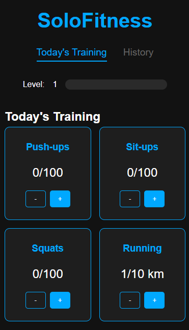

# SoloFitness

A Solo Leveling inspired fitness tracking application that helps you level up your training journey. Track your daily workouts, maintain streaks, and level up as you progress towards your fitness goals.



## Features

- **Daily Exercise Tracking**
  - Push-ups (Target: 100)
  - Sit-ups (Target: 100)
  - Squats (Target: 100)
  - Running (Target: 10 km)

- **Leveling System**
  - Gain XP for completing daily targets
  - Level up as you consistently hit your goals
  - Track your progress with a sleek XP bar

- **Streak System**
  - Track consecutive days of completed workouts
  - Visual streak counter and progress bar
  - Target: 30-day streaks

- **History Tracking**
  - View historical workout data
  - Filter by different time periods (7, 30, 90 days, or all time)
  - Track total repetitions and distances

- **Modern UI/UX**
  - Solo Leveling inspired dark theme
  - Vibrant blue accents
  - Responsive design for all devices
  - PWA support for mobile installation

## Technologies Used

- **Frontend**
  - HTML5
  - CSS3 (Custom design, no frameworks)
  - Vanilla JavaScript
  - Progressive Web App (PWA)

- **Backend**
  - Node.js
  - Express.js
  - MongoDB

## Getting Started

### Prerequisites

- Node.js (v14 or higher)
- MongoDB
- npm or yarn

### Installation

1. Clone the repository:
```bash
git clone https://github.com/yourusername/solofitness.git
cd solofitness
```

2. Install dependencies:
```bash
npm install
```

3. Create a .env file in the root directory:
```env
MONGODB_URI=your_mongodb_connection_string
PORT=2000
```

4. Start the development server:
```bash
npm run dev
```

5. Open your browser and navigate to `http://localhost:2000`

## PWA Installation

1. Visit the application in a supported browser (Chrome, Edge, etc.)
2. Look for the "Install" or "Add to Home Screen" option
3. Install the app to have it available offline

## Project Structure

```
solofitness/
├── public/             # Static files
│   ├── css/           # Stylesheets
│   ├── js/            # Client-side JavaScript
│   ├── icons/         # PWA icons
│   ├── index.html     # Main HTML file
│   ├── history.html   # History page
│   ├── manifest.json  # PWA manifest
│   └── sw.js          # Service Worker
├── models/            # MongoDB models
├── server.js          # Express server
├── package.json       # Project dependencies
├── .env              # Environment variables
├── .gitignore        # Git ignore file
├── PLANNING.md       # Project planning document
└── TASKS.md          # Task tracking document
```

## Contributing

1. Fork the repository
2. Create your feature branch (`git checkout -b feature/amazing-feature`)
3. Commit your changes (`git commit -m 'Add some amazing feature'`)
4. Push to the branch (`git push origin feature/amazing-feature`)
5. Open a Pull Request

## License

This project is licensed under the MIT License - see the LICENSE file for details.

## Acknowledgments

- Inspired by Solo Leveling anime/manga
- Special thanks to the open-source community 